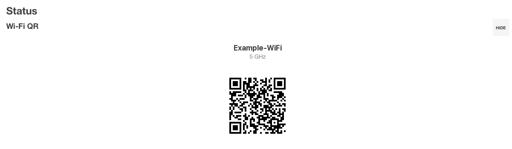

# Wi-Fi QR для OpenWrt

[English](README.md)

[](https://github.com/Nikitid/luci-app-wrqr/actions/workflows/ci.yml)
[](https://github.com/Nikitid/luci-app-wrqr/releases/latest)
[](LICENSE)

Пакет `luci-app-wrqr` добавляет на страницу LuCI **Status -> Overview** виджет с
QR-кодами для подключения к Wi-Fi.



## Возможности

- по одному QR-коду на каждую различающуюся активную точку доступа;
- одинаковые сети, вещаемые несколькими радиомодулями, объединяются в один код;
- отключённые, неподдерживаемые и не-AP интерфейсы не показываются.

## Требования

- OpenWrt 24.10 (IPK) или OpenWrt 25.12 (APK);
- LuCI.

## Установка

### OpenWrt 24.10

Скачайте последний `luci-app-wrqr_*_all.ipk` из
[Releases](https://github.com/Nikitid/luci-app-wrqr/releases) и загрузите его
через **System -> Software -> Upload Package**.

### OpenWrt 25.12

```sh
wget -O /tmp/nikitid-feed.sh \
  https://raw.githubusercontent.com/Nikitid/openwrt-feed/feed/install.sh
sh /tmp/nikitid-feed.sh luci-app-wrqr
```

Установщик проверяет ключ издателя, подключает общий подписанный репозиторий
приложений Nikitid и ставит только указанный пакет. Обновление:

```sh
apk update
apk upgrade luci-app-wrqr
```

## Как это работает

Виджет читает свежее состояние UCI и беспроводного стека на обычном опросе
статуса LuCI. Он только читает: ничего не перезапускает и ничего не
записывает - ни Wi-Fi, ни rpcd, ни uhttpd, ни роутер.

## Разработка

```sh
./scripts/ci-check.sh
```

Сборка, подпись и выпуск: [docs/DEVELOPMENT.md](docs/DEVELOPMENT.md).

## Документация

- [Карта репозитория](docs/MAP.md) - где что лежит
- [Разработка](docs/DEVELOPMENT.md) - сборка, подпись и выпуск

## Поддержка

Вопросы и сообщения об ошибках - в
[Issues](https://github.com/Nikitid/luci-app-wrqr/issues/new/choose), выберите
подходящую форму. Об уязвимости сообщайте приватно через
[security advisory](https://github.com/Nikitid/luci-app-wrqr/security/advisories/new).
Можно писать по-русски или по-английски.

## Лицензия

[MIT](LICENSE)
